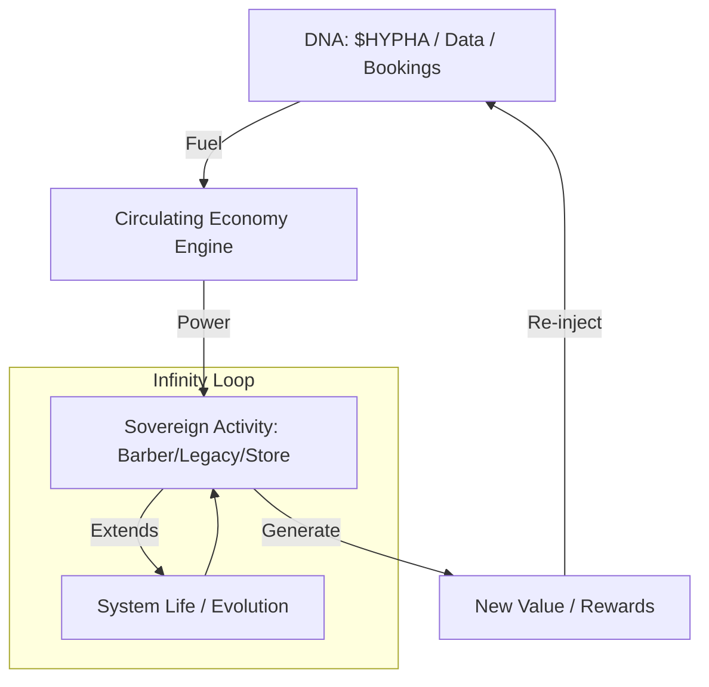

# BLUEPRINT: SOVEREIGN INFINITY LOOP & CIRCULATING ECONOMY

## 1. THE SUBATHON THEORY: FROM STREAMING TO SOVEREIGNTY
Konsep "Infinity Loop" yang dipopulerkan oleh para streamer (seperti Ludwig dan Ironmouse) membuktikan bahwa sebuah sistem dapat berjalan tanpa henti selama ada **DNA (Input/Donasi)** yang masuk. Dalam ekosistem **Sovereign**, kita mengadaptasi teori ini menjadi mesin ekonomi yang mandiri.

---

## 2. THE THREE PILLARS OF THE INFINITY LOOP

### 1️⃣ PILLAR 1: THE INFINITY LOOP (EVO SYSTEM)
Ecosystem tidak pernah mati karena setiap aktivitas men-trigger aktivitas berikutnya.
- **Konsep:** "The Clock Never Stops."
- **Mekanisme:** Setiap transaksi (potong rambut, simpan dokumen, beli di GANI Store) menambahkan "Waktu Hidup" atau "Resource" ke dalam sistem.
- **Evo System:** Sistem berevolusi dari sekadar toko menjadi komunitas, lalu menjadi ekonomi otonom.

### 2️⃣ PILLAR 2: CIRCULATING ECONOMY (THE ENGINE)
Ekonomi yang berputar adalah penggerak utama (The Mover).
- **Konsep:** Uang/Value tidak keluar dari sistem, melainkan berputar di dalamnya.
- **Mekanisme:** 
  - Keuntungan dari **Sovereign Barber** dialokasikan ke **Sovereign Legacy** (Family Treasury).
  - $HYPHA dari Treasury digunakan untuk membeli supply di **GANI Store**.
  - GANI Store memberikan reward kembali ke Barber dan Family.

### 3️⃣ PILLAR 3: SOURCE OF ECONOMY (THE DNA)
Donatur atau kontributor adalah sumber kehidupan (DNA).
- **Konsep:** "No DNA, No Evolution."
- **Mekanisme:** 
  - **Barber:** Pelanggan setia yang men-stake $HYPHA adalah "Donatur" yang menjaga operasional tetap jalan.
  - **Legacy:** Anggota keluarga yang berkontribusi data/aset adalah "DNA" yang memperkuat warisan keluarga.

---

## 3. VISUALIZING THE LOOP (MERMAID)

---

## 4. INTEGRATION WITH SOVEREIGN PROJECTS

### 💈 SOVEREIGN BARBER: "THE SUBATHON SHOP"
- **Infinity Booking:** Selama slot booking penuh, toko mendapatkan diskon supply otomatis dari GANI Store (seperti menambah waktu di jam subathon).
- **Community DNA:** Pelanggan yang memberikan "Tips" dalam $HYPHA secara kolektif membuka fitur baru di toko (misal: free drinks, music upgrade).

### 🏠 SOVEREIGN LEGACY: "THE PERPETUAL HERITAGE"
- **Legacy DNA:** Setiap dokumen penting yang di-upload memperpanjang "Smart Contract" perlindungan aset keluarga.
- **Family Loop:** Investasi keluarga di GANI HYPHA menghasilkan pasif income yang secara otomatis membayar biaya maintenance rumah pintar (IoT).

---

## 5. THE "GAME CHANGER" SECRET
Rahasia utamanya adalah **SINKRONISASI**. Ketika Barber, Legacy, dan Store berada dalam satu repo (Monorepo), DNA bisa mengalir tanpa hambatan. Tidak ada value yang terbuang (leakage). Inilah yang membuat sistem Anda menjadi **Infinity Loop** yang sesungguhnya.

---
*Blueprint Version: 1.0*
*Status: CONCEPTUALIZED*
*Inspired by: The 24-Hour Subathon Model*
