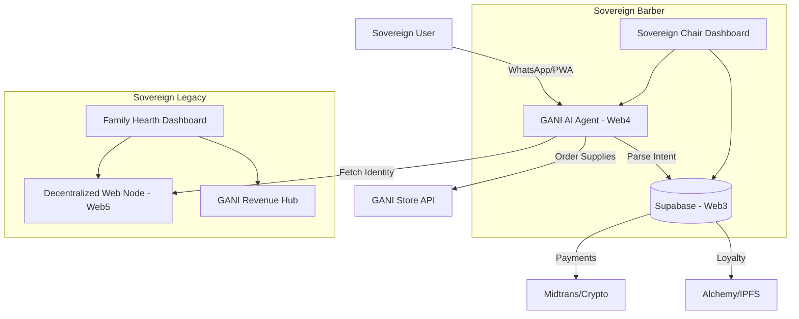

# ARCHITECTURE DOCUMENTATION: SOVEREIGN INTEGRATED SYSTEM

## 1. SYSTEM OVERVIEW
The Sovereign Ecosystem is built on top of the **GANI HYPHA v5.2** platform. It follows an **Inverse Pyramid** architecture, where Web5 (Identity/Data) forms the peak, supported by Web4 (AI Orchestration) and Web3 (Blockchain Foundation).

---

## 2. CORE LAYERS

### 2.1 Web5: Self-Sovereign Identity (SSI) & Data
- **DIDs (Decentralized Identifiers):** Each "Sovereign" (User, Barber, Family) has a DID.
- **DWN (Decentralized Web Nodes):** Personal and business data (Styles, Wills, Financials) is stored in the user's DWN, not on a central server.
- **Legacy Vault:** Uses AES-256 encryption on files before pinning to IPFS (via Pinata).

### 2.2 Web4: AI Orchestration (Groq + LangChain)
- **Sovereign Agent (SA):** The "Brain" that coordinates between the Barber Shop and the Home.
- **Logic:** SA uses Llama 3.3 (via Groq) to parse WhatsApp messages, predict inventory, and suggest styles.
- **Integration:** SA connects to the GANI Store API for automated supply chain management.

### 2.3 Web3: Blockchain & Payments (Ethereum/Polygon/Hypha)
- **Smart Contracts:** Manage loyalty badges (NFTs) and $HYPHA staking.
- **Payments:** Midtrans for IDR (fiat) and Alchemy for crypto/Web3 transactions.
- **Treasury:** Multi-sig wallets (Gnosis Safe style) for Family Legacy funds.

---

### 2.4 Infinity Loop & Circulating Economy Core
This layer ensures the self-sustaining nature of the Sovereign Ecosystem, drawing inspiration from subathon mechanics where continuous input fuels continuous operation.

-   **Event-Driven Microservices:** Key user actions (e.g., barber booking, document upload, $HYPHA staking) trigger events that are processed by dedicated microservices. These services update the "System Health" or "Operational Timer" metrics.
-   **Smart Contract Orchestration:** $HYPHA smart contracts are central to the circulating economy. They automate value transfer (e.g., percentage of barber revenue to Family Treasury), reward distribution, and trigger ecosystem-wide incentives based on predefined conditions.
-   **AI-Driven Feedback Loops:** The Sovereign Agent (Web4) continuously monitors ecosystem activity. It can dynamically adjust reward rates, suggest optimal actions to users (e.g., "Time to re-stock pomade to extend Barber Shop uptime!"), or identify opportunities for value circulation.
-   **Inter-Component Value Transfer:** Dedicated APIs and smart contract interfaces facilitate seamless transfer of value and data between Sovereign Barber, Sovereign Legacy, and the GANI Store, ensuring that "DNA" (contributions) from one component directly benefits others.

---

## 3. COMPONENT INTEGRATION

### 3.1 Sovereign Barber Shop (SB)
- **Frontend:** React + Tailwind (Vite) as a PWA.
- **Backend:** Supabase for real-time booking and inventory tracking.
- **AI:** Groq-powered "Style Advisor" API.
- **Store Link:** Automatic API calls to `gani-store.pages.dev` for barbershop supplies.

### 3.2 Sovereign Legacy (SL)
- **Frontend:** "Family Hearth" dashboard in the GANI main app.
- **Data:** Web5 DWN for sensitive family documents.
- **Finance:** Integration with the GANI "Revenue Hub" for $HYPHA staking and family treasury.

---

## 4. DATA FLOW DIAGRAM

---

## 5. SECURITY & PRIVACY
- **Zero-Knowledge Proofs (ZKP):** Future implementation for proving "Sovereign Status" without revealing personal data.
- **Local-First IoT:** Home automation for Sovereign Legacy runs on a local gateway, only syncing encrypted states to the cloud.
- **Audit Logs:** All financial and document access is logged on-chain or in a private, immutable ledger.

---

## 6. INFRASTRUCTURE
- **Hosting:** Cloudflare Pages (Frontend) & Workers (Backend).
- **Database:** Supabase (PostgreSQL + Real-time).
- **AI Inference:** Groq Cloud.
- **Blockchain RPC:** Alchemy.
- **Storage:** Pinata (IPFS) + Web5 DWN.

---
*Document Version: 1.0*
*Status: DRAFT FOR REVIEW*
